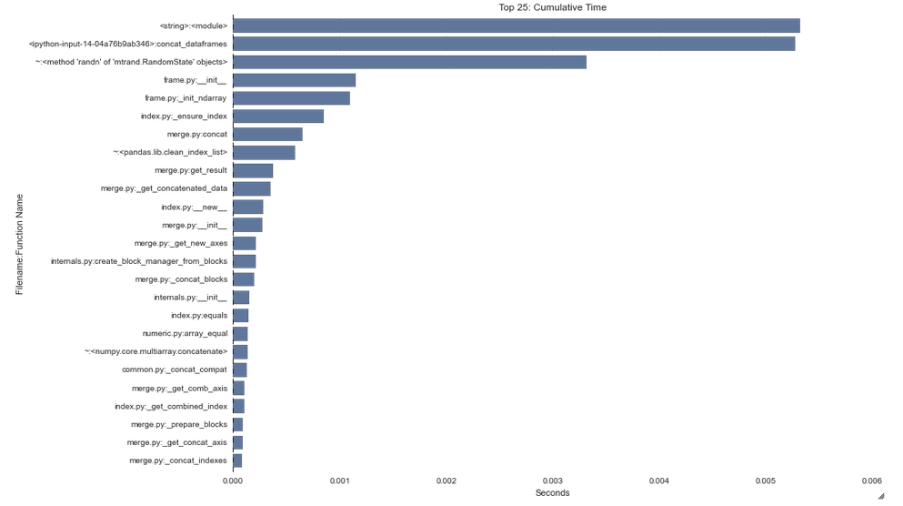
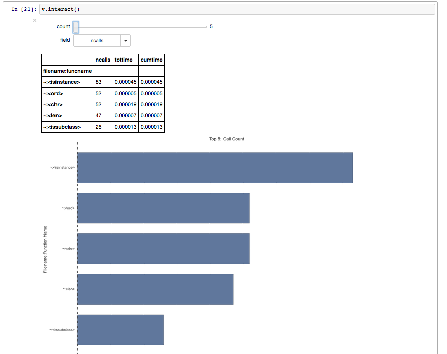
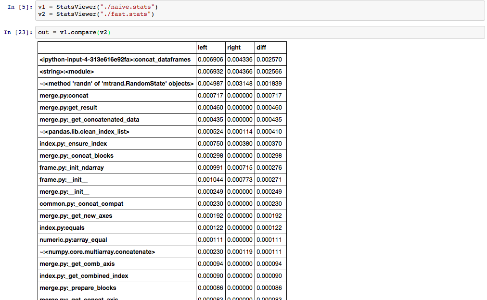
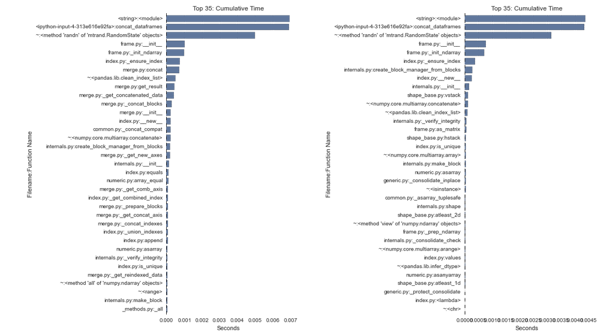

pstatsviewer
=============

An Interactive,  Graphical, Interactive PStats viewer/diff tool for IPython Notebook.

`pstatsviewer` uses `pandas` dataframes to parse, align, and display the output of Python's built-in profiling tool, `cProfile`.
It also provides the ability to compare two distinct pstats files, making it easy to do performance regression testing with different versions of the same code.

##Examples:
```
v1 = StatsViewer("./naive.stats")
v2 = StatsViewer("./fast.stats")

v1.view(25, 'cumtime')
```


```
v1.interact()
```

```
v1.compare(v2)
```



More usage examples can be seen in the [Example Notebook on NBViewer](http://nbviewer.ipython.org/github/ssanderson/pstats-view/blob/master/examples/ExampleView.ipynb)
(note that the interactive widget view will not display on nbviewer).

##Running the Example Notebook
1. Clone this repo.
2. Run `pip install -r requirements.txt`.
3. Run `ipython notebook examples/ExampleView.ipynb`.
